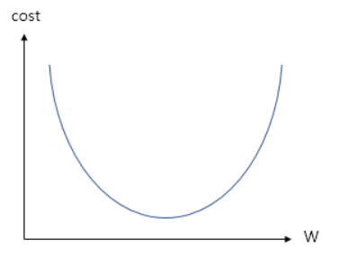
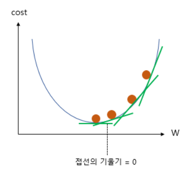
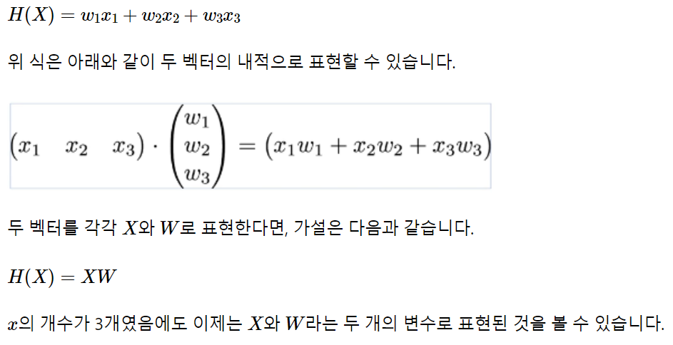
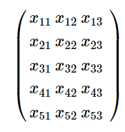

# Linear Regression

1. 모델을 학습시키기 위한 데이터는 파이토치의 텐서(torch.tensor) 형태여야한다.

2. 입력과 출력을 각기 다른 텐서에 저장. 보편적으로 입력은 x, 출력은 y사용하여 표기한다.

   ```python
   x_train = torch.FloatTensor([[1], [2], [3]])
   y_train = torch.FloatTensor([[2], [4], [6]])
   ```


### 가설(Hypothesis) 수립

선형회귀의 가설: 
$$
y = Wx + b 
$$

$$
H(x) = Wx + b
$$


 x와 곱해지는 W를 가중치(Weight)라고 하며, b를 편향(bias)이라고 한다.


### 비용함수(cost function)

> 비용 함수(cost function) = 손실 함수(loss function) = 오차 함수(error function) = 목적 함수(objective function)

평균 제곱 오차(Mean Squared Error, MSE)는 이번 회귀 문제에서 적절한 W와 b를 찾기위해서 최적화된 식입니다. 그 이유는 평균 제곱 오차의 값을 최소값으로 만드는 W와 b를 찾아내는 것이 가장 훈련 데이터를 잘 반영한 직선을 찾아내는 일이기 때문.

-> 평균 제곱 오차를 W와 b에 의한 비용 함수(Cost function)로 재정의해보면
$$
cost(W,b) = {1\over n}(\sum_{i = 1}^{n}{[y^i - H(x^i)]^2})
$$
즉, Cost(W,b)가 최소가 되는 W, b를 구하는게  훈련 데이터를 가장 잘 나타내는 직선을 구하는 것.


### Optimizer - Gradient Descent (경사 하강법)

앞서 정의한 비용 함수(Cost Function)의 값을 최소로 하는 W와 b를 찾는 방법이 **옵티마이저(Optimizer)** 알고리즘 or **최적화 알고리즘**이라고도 부른다. 이 옵티마이저 알고리즘을 통해 적절한 W와 b를 찾아내는 과정을 머신 러닝에서 학습(training)이라고 부른다. 그 중 가장 기본적인 옵티마이저 알고리즘이 경사 하강법(Gradient Descent).


> 기울기(W)가 지나치게 크면 실제값과 예측값의 오차가 커지고, 기울기가 지나치게 작아도 실제값과 예측값의 오차가 커집니다. 사실 b 또한 마찬가지인데 b가 지나치게 크거나 작으면 오차가 커집니다.



(설명의 편의를 위해 편향 b가 없이 단순히 가중치 W만을 사용한 H(x)=Wx라는 가설을 가지고, 경사 하강법을 설명)

기울기 W가 무한대로 커지면 커질 수록 cost의 값 또한 무한대로 커지고, 반대로 기울기 W가 무한대로 작아져도 cost의 값은 무한대로	커집니다. 위의 그래프에서 cost가 가장 작을 때는 맨 아래의 볼록한 부분입니다. 

**기계가 해야할 일은 cost가 가장 최소값을 가지게 하는 W를 찾는 일**이므로, 맨 아래의 볼록한 부분의 W의 값을 찾아야 합니다

기계는 **임의의 초기값 W값을 정한 뒤에, 맨 아래의 볼록한 부분을 향해 점차 W의 값을 수정**해나갑니다. 위의 그림은 W값이 점차 수정	되는 과정을 보여줍니다. 그리고 이를 가능하게 하는 것이 경사 하강법(Gradient Descent)



​	즉, **cost가 최소화가 되는 지점은 접선의 기울기가 0이 되는 지점**이며, 또한 **미분값이 0**이 되는 지점입니다. 경사 하강법의 아이디어는 **비용 함수(Cost function)를 미분하여 현재 W에서의 접선의 기울기를 구하고, 접선의 기울기가 낮은 방향으로 W의 값을 변경하는 작업을 반복**하는 것에 있습니다. 이 반복 작업에는 **현재 W에 접선의 기울기를 구해 특정 숫자 α를 곱한 값을 빼서 새로운 W로 사용하는 식이 사용**됩니다. 즉, 아래의 수식은 접선의 기울기가 음수거나, 양수일 때 모두 **접선의 기울기가 0인 방향으로 W의 값을 조정**합니다.
$$
W := W - α \times {\partial cost(W) \over (\partial W) }
$$
α는 학습률(learning rate)로 W의 값을 변경할 때, 얼마나 크게 변경할지를 결정한다.


> 가설, 비용함수, 옵티마이저는 풀고자하는 문제에 다라 다를 수 있으며, 선형회귀에서 가장 적합한 비용함수는 평균 제곱 오차, 옵티마이저는 경사하강법이다.


#### Gradient Descent with torch.optim

> > torch.optim으로 간단히 gradient descent 구현 가능!
> >
> > * 시작할 때 optimizer 정의
> > * optimizer.zero_grad()로 gradient를 0으로 초기화
> > * cost.backward()로 비용 함수를 미분하여 gradient계산
> > * optimizer.step()으로 W와 b를 업데이트. gradient descent
> >
> > ```python
> > #optimizer 설정
> > optimizer = optim.SGD([W, b], lr=0.01)
> > nb_epochs = 2000 # 원하는만큼 경사 하강법을 반복
> > for epoch in range(nb_epochs + 1):
> > 
> >     # H(x) 계산
> >     hypothesis = x_train * W + b
> > 
> >     # cost 계산
> >     cost = torch.mean((hypothesis - y_train) ** 2)
> > 
> >     # cost로 H(x) 개선
> >     optimizer.zero_grad()
> >     cost.backward()
> >     optimizer.step()
> > ```


-> 하나의 정보(하나의 x)로부터 추측하는 모델에 대한 내용 = 단순 선형 회귀(Simple Linear Regression)

-> 대부분의 경우, 여러 개의 정보로부터 결론을 추측 =  다수의 x로부터 y를 예측하는 다중 선형 회귀(Multivariable Linear Regression)


## Multivariable Linear Regression

단순 선형 회귀와 다른 점은 독립 변수 x의 개수가 이제 1개가 아닌 여러개라는 점입니다.

예를 들어, x의 개수가 3개인 경우,


```
# 훈련 데이터
x1_train = torch.FloatTensor([[73], [93], [89], [96], [73]])
x2_train = torch.FloatTensor([[80], [88], [91], [98], [66]])
x3_train = torch.FloatTensor([[75], [93], [90], [100], [70]])
y_train = torch.FloatTensor([[152], [185], [180], [196], [142]])

# 가중치 w와 편향 b 초기화
w1 = torch.zeros(1, requires_grad=True)
w2 = torch.zeros(1, requires_grad=True)
w3 = torch.zeros(1, requires_grad=True)
b = torch.zeros(1, requires_grad=True)

 # H(x) 계산
    hypothesis = x1_train * w1 + x2_train * w2 + x3_train * w3 + b
```

이와 같이, 비효율적입니다. 이를 해결하기 위해 행렬 곱셈 연산(또는 벡터의 내적)을 사용합니다.




### 행렬 연산으로 이해하기

샘플(Sample): 전체 훈련 데이터의 개수를 셀 수 있는 1개의 단위

특성(feature): 각 샘플에서 y를 결정하게 하는 각각의 독립 변수 x

따라서, 위의 표에서 샘플의 갯수는 5개, 특성은 3개이다.

이는 독립 변수 x들의 수가 (샘플의 수 × 특성의 수) = 15개임을 의미합니다. 독립 변수 x들을 (샘플의 수 × 특성의 수)의 크기를 가지는 하나의 행렬로 표현해봅시다. 그리고 이 행렬을 X라고 하겠습니다.



그리고 여기에 가중치 w1,w2,w3을 원소로 하는 벡터를 W라하고 곱한 후 샘플 수만큼의 차원을 가지는 편향 벡터 B라하고 더한다 .


```python
#행렬연산으로 할 경우, 훈련데이터 또한 행렬로 선언
#훈련 데이터 선언
x_train  =  torch.FloatTensor([[73,  80,  75], 
                               [93,  88,  93], 
                               [89,  91,  80], 
                               [96,  98,  100],   
                               [73,  66,  70]])
#|x_train| = ([5,3]) 이므로 |W| = ([3,1])이어야!
y_train  =  torch.FloatTensor([[152],  [185],  [180],  [196],  [142]])
#|y_train| = ([5,1])

# 가중치와 편향 선언
W = torch.zeros((3, 1), requires_grad=True)
b = torch.zeros(1, requires_grad=True)

#가설
hypothesis = x_train.matmul(W) + b
```


### nn.Module로 구현하는 Linear Regression

이전에는 가설, 비용 함수를 직접 정의해서 선형 회귀 모델을 구현했습니다. 이번에는 파이토치에서 이미 구현되어져 제공되고 있는 함수들을 불러오는 것으로 더 쉽게 선형 회귀 모델을 구현해보겠습니다.

예를 들어 파이토치에서는 선형 회귀 모델이 nn.Linear()라는 함수로, 또 평균 제곱오차가 nn.functional.mse_loss()라는 함수로 구현되어져 있습니다.

```python
import torch.nn as nn
model = nn.Linear(input_dim, output_dim)

import torch.nn.functional as F
cost = F.mse_loss(prediction, y_train) #prediction = hypothesis
```


단순 선형 회귀 구현 - 다중 선형 회귀의 경우, nn.Linear()의 인자값과 lr만 바뀜.

```python
import torch
import torch.nn as nn
import torch.nn.functional as F
torch.manual_seed(1)

# 데이터
x_train = torch.FloatTensor([[1], [2], [3]])
y_train = torch.FloatTensor([[2], [4], [6]])

# 모델을 선언 및 초기화. 단순 선형 회귀이므로 input_dim=1, output_dim=1.
model = nn.Linear(1,1) #하나의 입력 x에 대해 하나의 출력 y를 가지므로
print(list(model.parameters())) #model에는 가중치 W와 편향 b가 저장되어져 있습니다. #이 값은 model.parameters()라는 함수를 사용하여 불러올 수 있다

# optimizer 설정. 경사 하강법 SGD를 사용하고 learning rate를 의미하는 lr은 0.01
optimizer = torch.optim.SGD(model.parameters(), lr=0.01) 
# 전체 훈련 데이터에 대해 경사 하강법을 2,000회 반복
nb_epochs = 2000
for epoch in range(nb_epochs+1):

    # H(x) 계산
    prediction = model(x_train)

    # cost 계산
    cost = F.mse_loss(prediction, y_train) # <== 파이토치에서 제공하는 평균 제곱 오차 함수

    # cost로 H(x) 개선하는 부분
    # gradient를 0으로 초기화
    optimizer.zero_grad()
    # 비용 함수를 미분하여 gradient 계산
    cost.backward() # backward 연산
    # W와 b를 업데이트
    optimizer.step()

    if epoch % 100 == 0:
    # 100번마다 로그 출력
      print('Epoch {:4d}/{} Cost: {:.6f}'.format(
          epoch, nb_epochs, cost.item()
      ))

#학습된 모델을 예측에 사용
# 임의의 입력 4를 선언
new_var =  torch.FloatTensor([[4.0]]) 
# 입력한 값 4에 대해서 예측값 y를 리턴받아서 pred_y에 저장
pred_y = model(new_var) # forward 연산
# y = 2x 이므로 입력이 4라면 y가 8에 가까운 값이 나와야 제대로 학습이 된 것
print("훈련 후 입력이 4일 때의 예측값 :", pred_y) 
```

* H(x) 식에 입력 x로부터 예측된 y를 얻는 것을 forward 연산이라고 한다.
* 학습 과정에서 비용 함수를 미분하여 기울기를 구하는 것을 backward 연산이라고 한다.


### 클래스로 파이토치 모델 구현하기

파이토치의 대부분의 구현체들은 대부분 모델을 생성할 때 클래스(Class)를 사용하고 있습니다. 앞서 배운 선형 회귀를 클래스로 구현해보겠습니다. 앞서 구현한 코드와 다른 점은 **오직 클래스로 모델을 구현**했다는 점입니다.


단순 선형 회귀 모델을 클래스로 구현 **

```python
class LinearRegressionModel(nn.Module): # torch.nn.Module을 상속받는 파이썬 클래스
    def __init__(self): #
        super().__init__()
        self.linear = nn.Linear(1, 1) # 단순 선형 회귀이므로 input_dim=1, output_dim=1.

    def forward(self, x):
        return self.linear(x)

model = LinearRegressionModel()
```

위와 같은 클래스를 사용한 모델 구현 형식은 대부분의 파이토치 구현체에서 사용하고 있는 방식으로 반드시 숙지할 필요가 있습니다.

클래스(class) 형태의 모델은 nn.Module 을 상속받습니다. 그리고 __init__()에서 모델의 구조와 동작을 정의하는 생성자를 정의. 이는 파이썬에서 객체가 갖는 속성값을 초기화하는 역할로, 객체가 생성될 때 자동으호 호출됩니다. super() 함수를 부르면 여기서 만든 클래스는 nn.Module 클래스의 속성들을 가지고 초기화 됩니다. foward() 함수는 모델이 학습데이터를 입력받아서 forward 연산을 진행시키는 함수입니다. 이 forward() 함수는 model 객체를 데이터와 함께 호출하면 자동으로 실행이됩니다. 예를 들어 model이란 이름의 객체를 생성 후, model(입력 데이터)와 같은 형식으로 객체를 호출하면 자동으로 forward 연산이 수행됩니다. 

```python
prediction = model(x_train)
```

모델을 클래스로 구현한 코드는 여기를 참조: https://github.com/cottonlove/MLbasic_pytorch/blob/main/01_basicML/linear%20regression.py


### Minibatch Gradient Descent(미니배치 경사하강법)

많은 양의 데이터를 한번에 학습시키는 것은 불가능 -> 일부분의 데이터로만 학습

* 전체 데이터를 균일하게 나눠서 학습하자!
