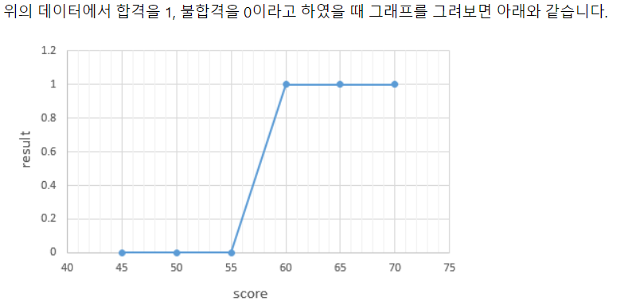
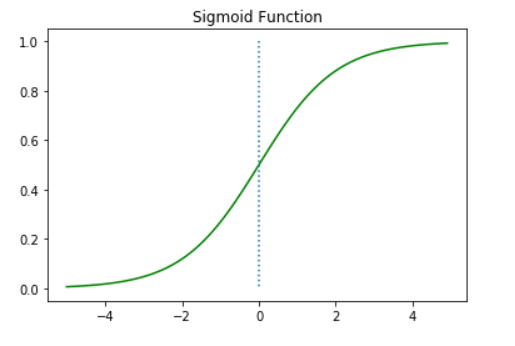
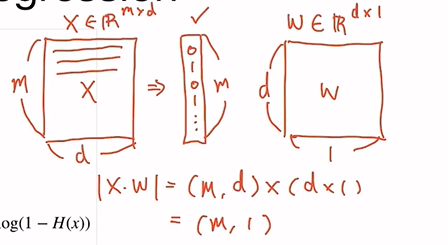
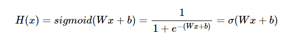
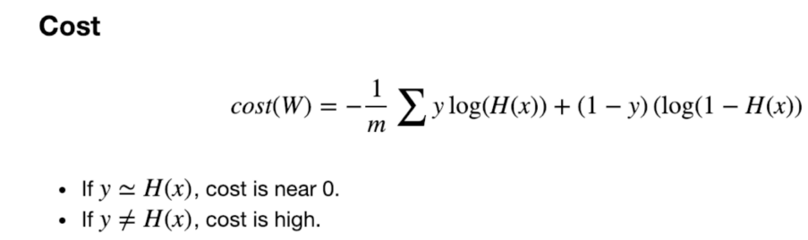
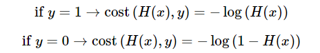
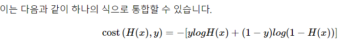
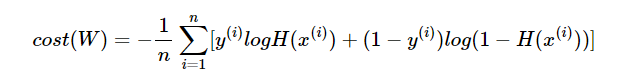
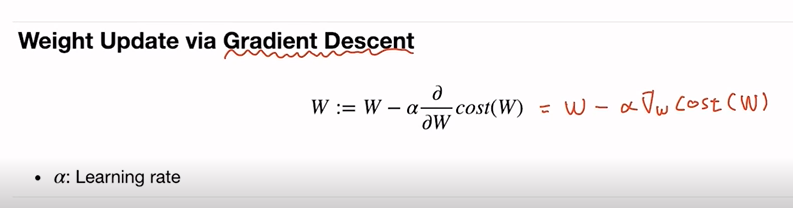

# Logistic Regression (로지스틱 회귀)

**둘 중 하나를 결정하는 문제(이진 분류 = Binary Classification)를 풀기 위한 대표적인 알고리즘 **


E.g. 시험 성적에 따라 합격, 불합격이 기재된 데이터 -> 시험 성적을(x) 보고 합격,불합격(y) 예측



이러한 점들을 표현하는 그래프는 **알파벳의 S자 형태로 표현**됩니다. **이러한 x와 y의 관계를 표현**하기 위해서는 Wx+b와 같은 직선 함수가 아니라 S자 형태로 표현할 수 있는 함수가 필요합니다. 이런 문제에 **직선(선형 회귀)을 사용할 경우 분류 작업이 잘 동작하지 않습니다.**

그래서 이번 로지스틱 회귀의 가설은 선형 회귀 때의 H(x)=Wx+b가 아니라, 위와 같이 S자 모양의 그래프를 만들 수 있는 어떤 **특정 함수 f를 추가적으로 사용**하여 H(x)=f(Wx+b)의 가설을 사용할 겁니다. 그리고 위와 같이 S자 모양의 그래프를 그릴 수 있는 어떤 함수 f가 이미 널리 알려져있습니다. 바로 **시그모이드 함수**입니다.


### 시그모이드 함수



시그모이드 함수는 입력값이 한없이 커지면 1에 수렴하고, 입력값이 한없이 작아지면 0에 수렴합니다. **시그모이드 함수의 출력값은 0과 1 사이의 값을 가지는데** 이 특성을 이용하여 분류 작업에 사용.

예를 들어 임계값을 0.5라고 정해보겠습니다. 출력값이 0.5 이상이면 1(True), 0.5이하면 0(False)으로 판단하도록 할 수 있습니다. 이를 확률이라고 생각하면 해당 레이블에 속할 확률이 50%가 넘으면 해당 레이블로 판단하고, 해당 레이블에 속할 확률이 50%보다 낮으면 아니라고 판단하는 것으로 볼 수 있습니다.

* sigmoid function: 1/1+e^(-x)


### Hypothesis (가설)





* sigmoid function: 1/1+e^(-x)
* H(X) = P (y=1 ; W) = 1- P(y=0 ; W)


### Cost





로지스틱 회귀의 가설이 H(x)=sigmoid(Wx+b)인 것은 알았습니다. 이제 **최적의 W와 b를 찾을 수 있는 비용 함수(cost function)를 정의**해야 합니다. 

그런데 혹시 앞서 선형 회귀에서 배운 비용 함수인 평균 제곱 오차(Mean Square Error, MSE)를 로지스틱 회귀의 비용 함수로 그냥 사용하면 안 될까요?

다음은 선형 회귀에서 사용했던 평균 제곱 오차의 수식입니다.

cost(W,b)=1n∑i=1n[y(i)−H(x(i))]2

위의 비용 함수 수식에서 가설은 이제 H(x)=Wx+b가 아니라 H(x)=sigmoid(Wx+b)입니다. 그리고 이 비용 함수를 미분하면 선형 회귀때와 달리 다음의 그림과 유사한 심한 비볼록(non-convex) 형태의 그래프가 나옵니다.


위와 같은 그래프에 경사 하강법을 사용할 경우의 문제점은 경사 하강법이 오차가 최소값이 되는 구간에 도착했다고 판단한 그 구간이 실제 오차가 완전히 최소값이 되는 구간이 아닐 수 있다는 점입니다. 이를 전체 함수에 걸쳐 최소값인 글로벌 미니멈(Global Minimum)이 아닌 특정 구역에서의 최소값인 로컬 미니멈(Local Minimum)에 도달했다고 합니다. 이는 cost가 최소가 되는 가중치 W를 찾는다는 비용 함수의 목적에 맞지 않습니다.

**시그모이드 함수의 특징은 함수의 출력값이 0과 1사이의 값**이라는 점입니다. 즉, 실제값이 1일 때 예측값이 0에 가까워지면 오차가 커져야 하며, **실제값이 0일 때, 예측값이 1에 가까워지면 오차가 커져야 합니다. 그리고 이를 충족하는 함수**가 바로 **로그 함수**입니다.

다음은 y=0.5에 대칭하는 두 개의 로그 함수 그래프입니다.


실제값이 1일 때의 그래프를 주황색 선으로 표현하였으며, 실제값이 0일 때의 그래프를 초록색 선으로 표현하였습니다. 실제값이 1이라고 해봅시다. 이 경우, 예측값인 H(x)의 값이 1이면 오차가 0이므로 당연히 cost는 0이 됩니다. 반면, H(x)가 0으로 수렴하면 cost는 무한대로 발산합니다. 실제값이 0인 경우는 그 반대로 이해하면 됩니다. 이 두 개의 로그 함수를 식으로 표현하면 다음과 같습니다.






선형 회귀에서는 모든 오차의 평균을 구해 평균 제곱 오차를 사용했었습니다. 마찬가지로 여기에서도 모든 오차의 평균을 구합니다.




이제 **위 비용 함수에 대해서 경사 하강법을 수행하면서 최적의 가중치 W**를 찾아갑니다.


### Weight Update via Gradient Descent





# 클래스로 파이토치 모델 구현하기

파이토치의 대부분의 구현체들은 대부분 모델을 생성할 때 클래스(Class)를 사용하고 있습니다. 앞서 배운 로지스틱 회귀를 클래스로 구현해보겠습니다. 

**클래스를 사용한 모델 구현 형식은** 대부분의 파이토치 구현체에서 사용하고 있는 방식으로 **반드시 숙지**할 필요가 있습니다.

```python
class BinaryClassifier(nn.Module):
    def __init__(self):
        super().__init__()
        self.linear = nn.Linear(2, 1)
        self.sigmoid = nn.Sigmoid()

    def forward(self, x):
        return self.sigmoid(self.linear(x))
```

클래스(class) 형태의 모델은 nn.Module 을 상속받습니다. 

그리고 __init__()에서 모델의 구조와 동적을 정의하는 생성자를 정의합니다. 이는 파이썬에서 객체가 갖는 속성값을 초기화하는 역할로, 객체가 생성될 때 자동으호 호출됩니다. 

**super()** 함수를 부르면 여기서 만든 클래스는 nn.Module 클래스의 속성들을 가지고 초기화 됩니다.

**foward()** 함수는 모델이 학습데이터를 입력받아서 forward 연산을 진행시키는 함수입니다. 이 forward() 함수는 model 객체를 데이터와 함께 호출하면 자동으로 실행이됩니다. 예를 들어 model이란 이름의 객체를 생성 후, model(입력 데이터)와 같은 형식으로 객체를 호출하면 자동으로 forward 연산이 수행됩니다.

```python
model = BinaryClassifier()
```


- H(x) 식에 입력 x로부터 예측된 y를 얻는 것을 forward 연산이라고 합니다.
