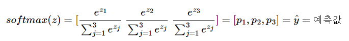

# Softmax Classification

**3개 이상의 선택지로부터 1개를 선택하는 문제인 다중 클래스 분류(Multi-Class classification)를 풀기 위한 알고리즘** 

* Softmax
* Cross Entropy
* Low-level Implementation
* High-level Implementation
* Training Example

### One-Hot Encoding

**범주형(Category. 종류) 데이터를 처리할 때 레이블을 표현하는 방법**

원-핫 인코딩은 선택해야 하는 선택지의 개수만큼의 차원을 가지면서, 각 선택지의 인덱스에 해당하는 원소에는 1, 나머지 원소는 0의 값을 가지도록 하는 표현 방법입니다.

E.g. 예를 들어 강아지, 고양이, 냉장고라는 3개의 선택지가 있다고 해보겠습니다.

강아지 = [1, 0, 0]
고양이 = [0, 1, 0]
냉장고 = [0, 0, 1]

총 선택지는 3개였으므로 위 벡터들은 전부 3차원의 벡터가 되었습니다. 그리고 각 선택지의 벡터들을 보면 해당 선택지의 인덱스에만 1의 값을 가지고, 나머지 원소들은 0의 값을 가집니다. 이와 같이 원-핫 인코딩으로 표현된 벡터를 **원-핫 벡터(one-hot vector)**라고 합니다.

정수 인코딩의 순서 정보가 도움이 되는 분류 문제도 물론 있습니다. 바로 각 클래스가 순서의 의미를 갖고 있어서 회귀를 통해서 분류 문제를 풀 수 있는 경우입니다. 예를 들어 {baby, child, adolescent, adult}나 {1층, 2층, 3층, 4층}이나 {10대, 20대, 30대, 40대}와 같은 경우가 이에 해당됩니다. 하지만 **일반적인 분류 문제에서는 각 클래스는 순서의 의미를 갖고 있지 않으므로 각 클래스 간의 오차는 균등한 것이 옳습니다.** 

정수 인코딩과 달리 원-핫 인코딩은 분류 문제 모든 클래스 간의 관계를 균등하게 분배합니다. 원-핫 벡터는 이처럼 각 클래스의 표현 방법이 무작위성을 가진다는 점을 표현할 수 있습니다. 뒤에서 다시 언급되겠지만 **이러한 원-핫 벡터의 관계의 무작위성은 때로는 단어의 유사성을 구할 수 없다는 단점**으로 언급되기도 합니다.

 소프트맥스 회귀를 통해 3개 이상의 선택지 중에서 1개를 고르는 다중 클래스 분류(Multi-Class Classification)를 실습

### 다중 클래스 분류(Multi-class Classification)

이진 분류가 두 개의 답 중 하나를 고르는 문제였다면, **세 개 이상의 답 중 하나를 고르는 문제를 다중 클래스 분류(Multi-class Classification)**라고 합니다. 

E.g. 붓꽃 품종 분류하기 문제

위 **붓꽃 품종 분류하기 문제** (꽃받침 길이, 꽃받침 넓이, 꽃잎 길이, 꽃잎 넓이라는 4개의 특성(feature)로부터 setosa, versicolor, virginica라는 3개의 붓꽃 품종 중 어떤 품종인지를 예측하는 문제로 전형적인 다중 클래스 분류 문제)를 어떻게 풀지 고민하기 위해 앞서 배운 로지스틱 회귀의 이진 분류를 복습해보겠습니다.

이번 챕터의 설명에서 입력은 X, 가중치는 W, 편향은 B, 출력은 Y^(Y hat)로 각 변수는 벡터 또는 행렬로 가정합니다.

- Y^은 예측값이라는 의미를 가지고 있으므로 가설식에서 H(X) 대신 사용되기도 합니다.

#### 1. 로지스틱 회귀 (Logistic Regression) -> 이진 분류

로지스틱 회귀에서 **시그모이드 함수**는 예측값을 0과 1 사이의 값으로 만듭니다. 예를 들어 스팸 메일 분류기를 로지스틱 회귀로 구현하였을 때, 출력이 0.75이라면 이는 이메일이 스팸일 확률이 75%라는 의미가 됩니다. 반대로, 스팸 메일이 아닐 확률은 25%가 됩니다. 이 두 확률의 총 합은 1입니다.

**가설 :** H(X)=sigmoid(WX+B)

#### 2. 소프트맥스 회귀 -> 다중 분류

소프트맥스 회귀는 확률의 총 합이 1이 되는 이 아이디어를 다중 클래스 분류 문제에 적용합니다. 소프트맥스 회귀는 각 클래스. 즉, 각 선택지마다 소수 확률을 할당합니다. 이때 총 확률의 합은 1이 되어야 합니다. 이렇게 되면 각 선택지가 정답일 확률로 표현됩니다.

결국 **소프트맥스 회귀는 선택지의 개수만큼의 차원을 가지는 벡터를 만들고, 해당 벡터가 벡터의 모든 원소의 합이 1이 되도록 원소들의 값을 변환시키는 어떤 함수를 지나게 만들어야 합니다**. 위의 그림은 붓꽃 품종 분류하기 문제 등과 같이 선택지의 개수가 3개일때, 3차원 벡터가 소프트맥스 함수를 지나 원소의 총 합이 1이 되도록 원소들의 값이 변환되는 모습을 보여줍니다.

**가설 :** H(X)=softmax(WX+B)

## **2. 소프트맥스 함수** Softmax Classification

소프트맥스 함수는 **분류해야하는 정답지(클래스)의 총 개수를 k**라고 할 때, **k차원의 벡터를 입력받아 각 클래스에 대한 확률을 추정**합니다. 

1. 소프트맥스 함수의 이해

   k차원의 벡터에서 i번째 원소를 zi, **i번째 클래스가 정답일 확률을 pi**로 나타낸다고 하였을 때 소프트맥스 함수는 pi를 다음과 같이 정의합니다.

   

   위에서 풀어야하는 문제의 경우 k=3이므로 3차원 벡터 z=[z1 z2 z3]의 입력을 받으면 소프트맥스 함수는 아래와 같은 출력을 리턴합니다.

   

   p1,p2,p3 각각은 1번 클래스가 정답일 확률, 2번 클래스가 정답일 확률, 3번 클래스가 정답일 확률을 나타내며 각각 0과 1사이의 값으로 총 합은 1이 됩니다. 

    **분류하고자 하는 클래스가 k개일 때, k차원의 벡터를 입력받아서 모든 벡터 원소의 값을 0과 1사이의 값으로 값을 변경하여 다시 k차원의 벡터를 리턴한다는 내용을 식으로 기재한 것.**

   

2. 그림을 통한 이해

   

   여기서는 샘플 데이터를 1개씩 입력으로 받아 처리한다고 가정해봅시다. 즉, 배치 크기가 1입니다.

   위의 그림에는 두 가지 질문이 있습니다. 첫번째 질문은 **소프트맥스 함수의 입력**에 대한 질문입니다. 하나의 샘플 데이터는 4개의 독립 변수 x를 가지는데 이는 **모델이 4(feature의 갯수)차원 벡터를 입력으로 받음**을 의미합니다. 그런데 **소프트맥스의 함수의 입력으로 사용되는 벡터는 벡터의 차원이 분류하고자 하는 클래스의 개수가 되어야 하므로 어떤 가중치 연산을 통해 3차원 벡터로 변환되어야 합니다.** 위의 그림에서는 소프트맥스 함수의 입력으로 사용되는 3차원 벡터를 z로 표현하였습니다.

   

   샘플 데이터 벡터를 소프트맥스 함수의 입력 벡터로 차원을 축소하는 방법은 간단합니다. **소프트맥스 함수의 입력 벡터 z의 차원수만큼 결과값의 나오도록 가중치 곱을 진행**합니다. 위의 그림에서 화살표는 총 (4 × 3 = 12) 12개이며 전부 다른 가중치를 가지고, 학습 과정에서 점차적으로 오차를 최소화하는 가중치로 값이 변경됩니다.

   두번째 질문은 **오차 계산 방법**에 대한 질문입니다. **소프트맥스 함수의 출력(예측값)은 분류하고자하는 클래스의 개수만큼 차원을 가지는 벡터로 각 원소는 0과 1사이의 값을 가집니다**. 이 각각은 특정 클래스가 정답일 확률을 나타냅니다. 여기서는 첫번째 원소인 p1은 virginica가 정답일 확률, 두번째 원소인 p2는 setosa가 정답일 확률, 세번째 원소인 p3은 versicolor가 정답일 확률로 고려하고자 합니다. 그렇다면 **이 예측값과 비교를 할 수 있는 실제값의 표현 방법**이 있어야 합니다. 소프트맥스 회귀에서는 실제값을 **원-핫 벡터**로 표현합니다.

   

   **위의 그림은** 소프트맥스 함수의 출력 벡터의 첫번째 원소 p1가 virginica가 정답일 확률, 두번째 원소 p2가 setosa가 정답일 확률, 세번째 원소 p3가 versicolor가 정답일 확률을 의미한다고 하였을 때, **각 실제값의 정수 인코딩은 1, 2, 3이 되고 이에 원-핫 인코딩을 수행하여 실제값을 원-핫 벡터로 수치화한 것**을 보여줍니다.

   

   

   예측값과 실제값 두 벡터의 오차를 계산하기 위해서 소프트맥스 회귀는 **비용 함수로 크로스 엔트로피 함수를 사용**하고 앞서 배운 선형 회귀나 로지스틱 회귀와 마찬가지로 **오차로부터 가중치, 편향를 업데이트**한다.

   

   **소프트맥스 회귀를 벡터와 행렬 연산으로 이해**해봅시다. 입력을 특성(feature)의 수만큼의 차원을 가진 입력 벡터 x라고 하고, 가중치 행렬을 W, 편향을 b라고 하였을 때, **소프트맥스 회귀에서 예측값을 구하는 과정을 벡터와 행렬 연산으로 표현**하면 아래와 같습니다.

   

   여기서 f는 특성의 수이며 c는 클래스의 개수에 해당됩니다.

### 붓꽃 품종 분류하기 행렬 연산으로 이해하기

------

위의 붓꽃 품종 분류 문제의 가설식을 행렬 연산으로 표현해보겠습니다. 우선 위의 예제의 데이터는 **전체 샘플의 개수가 5개, 특성이 4개**이므로 5 × 4 행렬 X로 정의합니다.

편의를 위해 각 행렬의 원소 위치를 반영한 변수로 표현.

이번 문제는 **선택지(=label 갯수)가 총 3개인 문제**이므로 **가설의 예측값으로 얻는 행렬 Y^의 열의 개수는 3개여야** 합니다. 그리고 **각 행은 행렬 X의 각 행(= sample의 갯수)의 예측값이므로 행의 크기는 동일해야** 합니다. 결과적으로 행렬 Y^의 크기는 5 × 3입니다.

크기 5 × 3의 행렬 Y^는 크기 5 × 4 입력 행렬 X과 **가중치 행렬 W의 곱으로 얻어지는 행렬이므로 가중치 행렬 W의 크기는 추정을 통해 4 × 3의 크기를 가진 행렬**임을 알 수 있습니다.

**편향 행렬 B는 예측값 행렬 Y^와 크기가 동일해야** 하므로 5 × 3의 크기를 가집니다.

### 비용 함수(Cost function)

------

소프트맥스 회귀에서는 **비용 함수로 크로스 엔트로피 함수를 사용**합니다. 여기서는 소프트맥스 회귀에서의 크로스 엔트로피 함수뿐만 아니라, 다양한 표기 방법에 대해서 이해해보겠습니다.

- **F.cross_entropy는 비용 함수에 소프트맥스 함수까지 포함하고 있음을 기억하고 있어야 구현 시 혼동하지 않습니다.**

