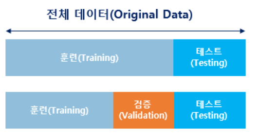
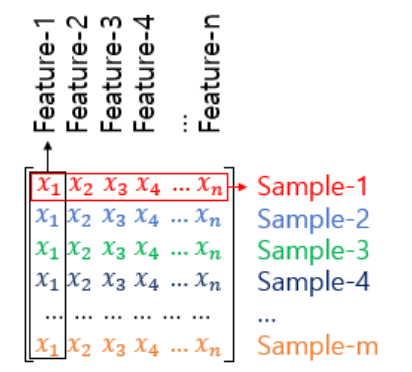
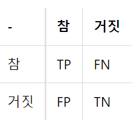

# 머신러닝 용어 

머신 러닝의 특징들에 대해서 배웁니다. 딥 러닝 또한 머신 러닝에 속하므로, 아래의 머신 러닝의 특징들은 모두 딥 러닝의 특징이기도 합니다.

### 1. 머신러닝 모델의 평가

실제 모델을 평가하고 학습할 때, 데이터를 train_data, val_data, test_data 이렇게 세가지로 나누는 것이 일반적이다.

**검증용 데이터**는 모델의 성능을 평가하기 위한 용도가 아니라, **모델의 성능을 조정**하기 위한 용도.

**과적합이 되고 있는 지를 판단하거나 하이퍼파라미터의 조정을 위한 용도**로 주로 training dataset에서 7:3 이런식으로 훈련용, 검증용으로 나누는 경우가 많음.

hyperparameter(초매개변수): 값에 따라 모델의 성능에 영향을 주는 매개변수

가중치와 편향과 같이 학습을 통해 바뀌는 변수들을 매개변수라고 한다.

hyperparameter와 매개변수의 가장 큰 차이점은 하이퍼파라미터는 보통 사용자가 직접 정해줄 수 있는 변수로 learnnig rate, nb_epoches, 은닉층의 수, 뉴런의 수, 드롭아웃 비율 등이 이에 해당한다. 반면, 매개변수는 사용자가 결정해주는 값이 아니라 모델이 학습하는 과정에서 얻어지는 값이다.

훈련용 데이터로 훈련을 모두 시킨 모델은 **검증용 데이터를 사용**하여 정확도를 검증하며 하이퍼파라미터를 **튜닝(tuning)**한다. 또, 모델의 매개변수는 검증용 데이터로 정확도가 검증되는 과정에서 점차 검증용 데이터에 점점 맞춰져가기 시작한다.

하이퍼파라미터 튜닝이 끝났다면, 검증용 데이터로 모델을 평가하는 것이 아니라 아직 모델이 보지 못한 데이터인 **테스트데이터로 모델의 진짜 성능을 평가**한다.

만약, 검증 데이터와 테스트 데이터를 나눌 만큼 데이터가 충분하지 않다면, k-폴드 교차 검증이라는 또 다른 방법을 사용하기도 한다.

### 2. 분류(Classification)와 회귀(Regression)

머신 러닝의 많은 문제는 분류 또는 회귀 문제에 속합니다. 이 책에서는 앞서 머신 러닝 기법 중 선형 회귀(Lineare Regression)과 로지스틱 회귀(Logistic Rgression)를 다루는데 선형 회귀를 통해 회귀 문제에 대해서 학습하고, 로지스틱 회귀를 통해 (이름은 회귀이지만) 분류 문제를 학습합니다.

분류는 또한 이진 분류(Binary Classification)과 다중 클래스 분류(Multi-Class Classification)로 나뉩니다. 엄밀히는 다중 레이블 분류(Multi-lable Classification)라는 또 다른 문제가 존재하지만, 이 책에서는 이진 분류와 다중 클래스 분류만 다룹니다.

**cf. multi-class VS multi-label**

multi-class는 each sample이 한 label에만 속한다고 가정. multi-label은 한 샘플이 여러개의 target label에 속할 수 있다고 가정. 

#### 1) 이진 분류 문제 (Binary Classification)

주어진 입력에 대해서 둘 중 하나의 답을 정하는 문제입니다. 시험 성적에 대해서 합격, 불합격인지 판단하고 메일로부터 정상 메일, 스팸 메일인지를 판단하는 문제 등이 이에 속합니다.

#### 2) 다중 클래스 분류(Multi-class Classification)

주어진 입력에 대해서 세 개 이상의 정해진 선택지(class) 중에서 하나로 판단하는 문제입니다.

#### 3) 회귀 문제 (Regression)

회귀 문제는 분류 문제처럼 0 또는 1이나 과학 책장, IT 책장 등과 같이 분리된(비연속적인) 답이 결과가 아니라 연속된 값을 결과로 가집니다. 예를 들어 시험 성적을 예측하는데 5시간 공부하였을 때 80점, 5시간 1분 공부하였을 때는 80.5점, 7시간 공부하였을 때는 90점 등이 나오는 것과 같은 문제가 있습니다. 그 외에도 시계열 데이터(일정한 시간동안 수집 된 일련의 순차적으로 정해진 **데이터** 셋의 집합으로 **시계열 데이터**의 분석 목적은 **시계열**이 갖고 있는 법칙성을 발견해 이를 모형화하고, 또 추정된 모형을 통하여 미래의 값을 forecasting 하는 것)를 이용한 주가 예측, 생산량 예측, 지수 예측 등이 이에 속합니다.

### 3. 지도 학습(Supervised Learning)과 비지도 학습(Unsupervised Learning)

머신 러닝은 크게 지도 학습, 비지도 학습, 강화 학습으로 나눕니다.

#### 1) 지도 학습

지도 학습이란 레이블(Label)이라는 정답과 함께 학습하는 것.

레이블이라는 말 외에도 y, 실제값 등으로 부르기도 한다. 모델은 예측값과 실제값의 차이인 오차를 줄이는 방식으로 학습을 하게 되는데 예측값은 y^과 같이 표현하기도 합니다.

#### 2) 비지도 학습

기본적으로 목적 데이터(또는 레이블)이 없는 학습 방법입니다. 대표적으로 군집(clustering)이나 차원 축소와 같은 학습 방법들을 비지도 학습이라고 합니다.

#### 3) 강화 학습

강화 학습은 어떤 환경 내에서 정의된 에이전트가 현재의 상태를 인식하여, 선택 가능한 행동들 중 보상을 최대화하는 행동 혹은 행동 순서를 선택하는 방법입니다.

### 4. 샘플(Sample)과 특성(Feature)

많은 머신 러닝 모델들, 특히 인공 신경망 모델은 독립 변수, 종속 변수, 가중치, 편향 등을 행렬 연산을 통해 연산하는 경우가 많습니다. 그래서 앞으로 인공 신경망을 배우게되면 훈련 데이터를 행렬로 표현하는 경우를 많이 보게 될 겁니다. 독립 변수 x의 행렬을 X라고 하였을 때, 독립 변수의 개수가 n개이고 데이터의 개수가 m인 행렬 X는 다음과 같습니다.

하나의 데이터, 하나의 행을 샘플(Sample)이라고 부릅니다. (데이터베이스에서는 레코드라고 부르는 단위입니다.) 종속 변수 y를 예측하기 위한 각각의 독립 변수 x를 특성(Feature)이라고 부릅니다.

### 5. 혼동 행렬(Confusion Matrix)

맞춘 문제수를 전체 문제수로 나눈 값을 정확도(Accuracy)라고 합니다. 하지만 정확도는 맞춘 결과와 틀린 결과에 대한 세부적인 내용을 알려주지는 않습니다. 이를 위해서 사용하는 것이 혼동 행렬(Confusion Matrix)입니다.

예를 들어 양성(Positive)과 음성(Negative)을 구분하는 이진 분류가 있다고 하였을 때 혼동 행렬은 다음과 같습니다. 각 열은 예측값을 나타내며, 각 행은 실제값을 나타냅니다.

이를 각각 TP(True Positive), TN(True Negative), FP(False Postivie), FN(False Negative)라고 하는데 True는 정답을 맞춘 경우고 False는 정답을 맞추지 못한 경우입니다. 그리고 Positive와 Negative는 각각 제시했던 정답입니다.

이 개념을 사용하면 또 새로운 개념인 정밀도(Precision)과 재현률(Recall)이 됩니다.

#### 1) 정밀도(Precision) - False rate

정밀도은 양성이라고 대답한 전체 케이스에 대한 TP의 비율입니다. 즉, 정밀도를 수식으로 표현하면 다음과 같습니다.

#### 2) 재현률(Recall) - Inspection rate

재현률은 실제값이 양성인 데이터의 전체 개수에 대해서 TP의 비율입니다. 즉, 양성인 데이터 중에서 얼마나 양성인지를 예측(재현)했는지를 나타냅니다.

### 6. 과적합(Overfitting)과 과소 적합(Underfitting)

* 과적합(Overfitting): 

훈련 데이터를 과하게 학습한 경우로 테스트 데이터나 실제 서비스에서의 데이터에 대해서는 정확도가 좋지 않은 현상이 발생합니다. 과적합 상황에서는 훈련 데이터에 대해서는 오차가 낮지만, 테스트 데이터에 대해서는 오차가 높아지는 상황이 발생합니다. 아래의 그래프는 과적합 상황에서 발생할 수 있는 훈련 횟수에 따른 훈련 데이터의 오차와 테스트 데이터의 오차의 변화를 보여줍니다.

X축의 에포크(epoch)는 전체 훈련 데이터에 대한 훈련 횟수를 의미합니다. 위의 그래프는 에포크가 3~4를 넘어가게 되면 과적합이 발생합니다. 위의 그래프는 테스트 데이터에 대한 오차가 점차 증가하는 양상을 보여줍니다. 반대로 말하면 훈련 데이터에 대한 정확도는 높지만, 테스트 데이터는 정확도가 낮은 상황이라고 말할 수도 있습니다. 즉, 테스트 데이터의 오차가 증가하기 전이나, 정확도가 감소하기 전에 훈련을 멈추는 것이 바람직합니다.

과적합 방지를 위해 테스트 데이터의 성능이 낮아지기 전에 훈련을 멈추는 것이 바람직하다고 했는데, 테스트 데이터의 성능이 올라갈 여지가 있음에도 훈련을 덜 한 상태를 반대로 **과소적합**(Underfitting)이라고 합니다. 과소 적합은 훈련 자체가 부족한 상태이므로 과대 적합과는 달리 훈련 데이터에 대해서도 보통 정확도가 낮다는 특징이 있습니다.

이러한 두 가지 현상을 과적합과 과소 적합이라고 부르는 이유는 머신 러닝에서 **학습 또는 훈련이라고 하는 과정을 적합(fitting)이라고도 부를 수 있기 때문**입니다. 모델이 주어진 데이터에 대해서 적합해져가는 과정이기 때문입니다.

딥 러닝을 할 때는 과적합을 막을 수 있는 드롭아웃(Dropout), 조기 종료(Early Stopping)과 같은 몇 가지 방법이 존재하는데 이는 인공 신경망 챕터에서 소개합니다.
