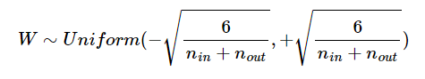
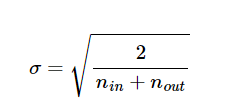
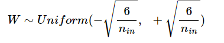
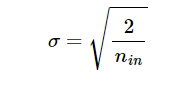
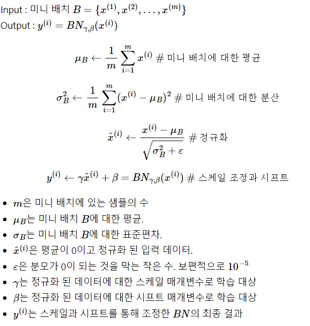
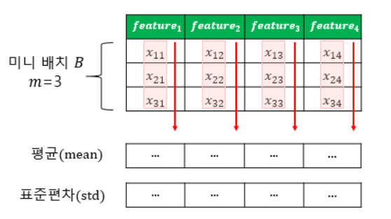
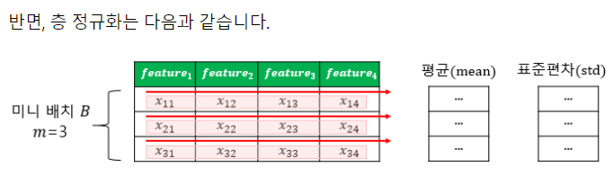

# 10. 기울기 소실(Gradient Vanishing)과 폭주(Exploding)

DNN을 학습하다보면 backpropagation과정에서 입력층으로 갈수록 기울기(Gradient)가 점차 작아지는 현상이 발생할 수 있다. 입력층에 가까운 층들에서 가중치들이 제대로 업데이트되지 않으면 최적의 모델을 찾을 수 없는데, 이를 기울기 소실(Gradient Vanishing)이라고 한다.

이와 반대의 경우로, 기울기가 점차 커지더니 가중치들이 비정상적으로 큰 값이 되며 발산하는 것을 기울기 폭주(Gradient Exploding)이라고 한다. RNN에서 발생할 수 있다.

## 기울기 소실 또는 기울기 폭주를 막는 방법 들

### 1. ReLU와 ReLU의 변형들

시그모이드 함수를 활성화함수로 사용하면 입력의 절대값이 큰 경우 함수의 출력값이 0 또는 1에 수렴하면서 기울기가 0에 가까워진다. 그래서 역전파 과정에서 전파시킬 기울기가 점차 사라져 입력층으로 갈수록 제대로 역전파가 되지않는 gradient vanishing문제가 발생할 수 있다.

이 문제를 완화하는 가장 간단한 방법은 은닉층의 활성화함수로 시그모이드, 하이퍼볼릭탄젠트가 아닌 ReLU나 ReLU의 변형함수인 Leaky ReLU등을 사용하는 것이다.

- 은닉층에서는 시그모이드 함수를 사용하지 말 것.
- Leaky ReLU를 사용하면 모든 입력값에 대해서 기울기가 0에 수렴하지 않아 죽은 ReLU 문제를 해결한다.
- 은닉층에서는 ReLU나 Leaky ReLU와 같은 ReLU 함수의 변형들을 사용할 것.

### 2. 가중치 초기화(Weight Initialization)

같은 모델을 훈련시키더라도 가중치의 초기값에 따라 모델의 훈련 결과가 달라진다. 즉, 가중치 초기화를 적절히 해주면 기울기 소실 문제를 완화시킬 수 있다.

- 시그모이드 함수나 하이퍼볼릭탄젠트 함수를 사용할 경우에는 세이비어 초기화 방법이 효율적입니다.
- ReLU 계열 함수를 사용할 경우에는 He 초기화 방법이 효율적입니다.
- ReLU + He 초기화 방법이 좀 더 보편적입니다.

#### 1. 세이비어 초기화(**Xavier Initialization**)

이 방법은 균등 분포(Uniform Distribution) 또는 정규 분포(Normal distribution)로 초기화하는 방식이 두 가지 경우로 나뉘며, 이전 층의 뉴런 개수와 다음 층의 뉴런 개수를 가지고 식을 세운다. 이전 층의 뉴런의 개수를 nin, 다음 층의 뉴런의 개수를 nout이라고 하자.

세이비어 초기화는 여러 층의 기울기 분산 사이에 균형을 맞춰서 특정 층이 너무 주목을 받거나 다른 층이 뒤쳐지는 것을 막는다. 그런데 세이비어 초기화는 시그모이드 함수나 하이퍼볼릭 탄젠트 함수와 같은 S자 형태인 활성화 함수와 함께 사용할 경우에는 좋은 성능을 보이지만, ReLU와 함께 사용할 경우에는 성능이 좋지 않다.

1) 균등 분포를 사용하여 가중치를 초기화할 경우 다음과 같은 균등 분포 범위를 사용하라고 한다.

   

   다시 말해 root(6/(nin+nout)를 m이라고 하였을 때, −m과 +m 사이의 균등 분포를 의미합니다.

2) 정규 분포로 초기화할 경우에는 평균이 0이고, 표준 편차 σ가 다음을 만족하도록 한다.

#### 2. He 초기화(He Initialization)

ReLU 함수 또는 ReLU의 변형 함수들을 활성화 함수로 사용할 경우에는 He 초기화(He initialization)방법을 쓰는 것이 좋다.

He 초기화(He initialization)는 세이비어 초기화와 유사하게 정규 분포와 균등 분포 두 가지 경우로 나눈다. 다만, He 초기화는 세이비어 초기화와 다르게 다음 층의 뉴런의 수를 반영하지 않는다. 전과 같이 이전 층의 뉴런의 개수를 nin이라고 하자.

1) 균등 분포로 초기화 할 경우에는 다음과 같은 균등 분포 범위를 가지도록 한다.

   

2) 정규 분포로 초기화할 경우에는 표준 편차 σ가 다음을 만족하도록 한다.

   

   

### 3. 배치 정규화(Batch Normalization)

ReLU 계열의 함수와 He 초기화 이 두 방법을 사용하더라도 훈련 중에 언제든 다시 발생할 수 있다.

기울기 소실이나 폭주를 예방하는 또 다른 방법은 배치 정규화(Batch Normalization)로 배치 정규화는 **인공 신경망의 각 층에 들어가는 입력을 평균과 분산으로 정규화**하여 학습을 효율적으로 만든다.

1) 내부 공변량 변화 (Internal Covariate Shift)

   : 학습 과정에서 **층 별로 입력 데이터 분포가 달라지는 현상**

   이전 층들의 학습에 의해 이전 층의 가중치 값이 바뀌게 되면, 현재 층에 전달되는 입력 데이터의 분포가 현재 층이 학습했던 시점의 분포와 차이가 발생한다. 배치 정규화를 제안한 논문에서는 기울기 소실/폭주 등의 딥 러닝 모델의 불안전성이 층마다 입력의 분포가 달라지기 때문이라고 주장.

   - 공변량 변화는 훈련 데이터의 분포와 테스트 데이터의 분포가 다른 경우를 의미합니다.
   - 내부 공변량 변화는 신경망 층 사이에서 발생하는 입력 데이터의 분포 변화를 의미합니다.

2) 배치 정규화

   : 한 번에 들어오는 배치 단위로 정규화하는 것으로 각 층에서 활성화 함수를 통과하기 전에 수행된다.

   배치 정규화를 요약하면 다음과 같습니다. 입력에 대해 평균을 0으로 만들고, 정규화를 합니다. 그리고 정규화 된 데이터에 대해서 스케일과 시프트를 수행합니다. 이 때 두 개의 매개변수 γ와 β를 사용하는데, γ는 스케일을 위해 사용하고, β는 시프트를 하는 것에 사용하며 다음 레이어에 일정한 범위의 값들만 전달되게 합니다.

   배치 정규화의 수식은 다음과 같습니다. 아래에서 BN은 배치 정규화를 의미합니다.

   

   배치 정규화는 학습 시 배치 단위의 평균과 분산들을 차례대로 받아 이동 평균과 이동 분산을 저장해놓았다가 테스트 할 때는 해당 배치의 평균과 분산을 구하지 않고 구해놓았던 평균과 분산으로 정규화를 합니다.

   - 배치 정규화를 사용하면 시그모이드 함수나 하이퍼볼릭탄젠트 함수를 사용하더라도 기울기 소실 문제가 크게 개선됩니다.
   - 가중치 초기화에 훨씬 덜 민감해집니다.
   - 훨씬 큰 학습률을 사용할 수 있어 학습 속도를 개선시킵니다.
   - 미니 배치마다 평균과 표준편차를 계산하므로 훈련 데이터에 일종의 잡음을 넣는 부수 효과로 과적합을 방지하는 효과도 냅니다. 하지만 부수적 효과이므로 드롭 아웃과 함께 사용하는 것이 좋습니다.
   - 배치 정규화는 모델을 복잡하게 하며, 추가 계산을 하는 것이므로 테스트 데이터에 대한 예측 시에 실행 시간이 느려집니다. 그래서 서비스 속도를 고려하는 관점에서는 배치 정규화가 꼭 필요한지 고민이 필요합니다.
   - 배치 정규화의 효과는 굉장하지만 내부 공변량 변화때문은 아니라는 논문도 있습니다. : https://arxiv.org/pdf/1805.11604.pdf

3) 배치 정규화의 한계

   1. 미니 배치 크기에 의존적이다.

      배치 정규화는 너무 작은 배치 크기에서는 잘 동작하지 않을 수 있습니다. 단적으로 배치 크기를 1로 하게되면 분산은 0이 됩니다. 작은 미니 배치에서는 배치 정규화의 효과가 극단적으로 작용되어 훈련에 악영향을 줄 수 있습니다. 배치 정규화를 적용할때는 작은 미니 배치보다는 크기가 어느정도 되는 미니 배치에서 하는 것이 좋습니다.

   2. RNN에 적용하기 어렵다.

      RNN은 각 시점(time step)마다 다른 통계치를 가지고 이는 RNN에 뱇 정규화를 적용하는 것을 어렵게 한다.

      

### 5. 층 정규화 (Layer Normalization)

 배치 크기에도 의존적이지 않으며, RNN에도 적용하는 것이 수월하다.

층 정규화와 배치 정규화를 시각화하면 다음과 같다. (미니 배치: 동일한 특성개수를 가진 다수의 샘플들)

* m이 3이고 특성의 수가 4일때의 배치정규화

  

* m이 3이고 특성의 수가 4일때의 층 정규화

  

