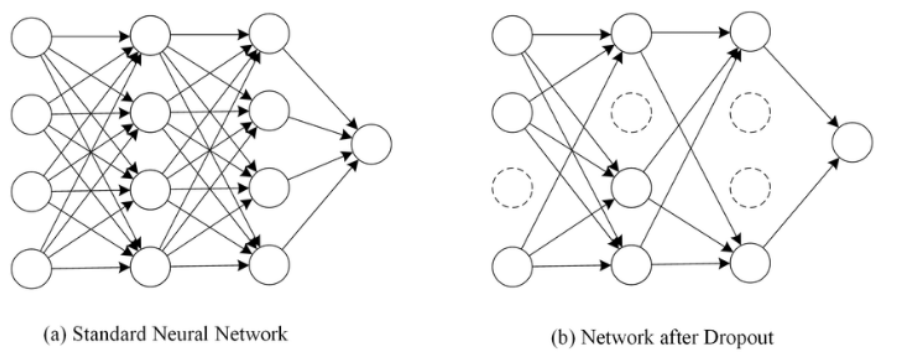

# 과적합(Overfitting)을 막는 방법들

train data에 모델이 overfitting되는 현상은 모델의 성능을 떨어트리는 주요 이슈이다. 모델이 과적합되면 train data에 대한 정확도는 높을 지 몰라도, 새로운 데이터(validation data or test data)에 대해서는 정확도가 낮게 나온다. 


### 1. 데이터의 양 늘리기

학습 데이터의 양이 적을 경우, 과적합 현상이 발생할 확률이 늘어난다. 그래서 학습 데이터의 양을 늘려, 데이터의 일반적인 패턴을 학습하게 하여 과적합을 방지할 수 있다.

만약, 학습 데이터의 양이 적은 경우, 기존 데이터를 변형하고 추가하는 방식으로 학습 데이터의 양을 늘리기도 하는데 이를 **Data Augmentation**이라고 한다. 이미지의 경우, data augmentation이 많이 사용되는데, 이미지를 회전시키거나 노이즈를 추가하고 일부분을 수정하는 방식으로 데이터를 증식시킨다.

(이때, 어떤 task를 하는 지에 따라 어떤 data augmentation을 쓰는게 좋을 지 고려해야함. 예를 들어, 상하좌우 반전이 결과에 큰 영향을 미치는 경우, flip 사용 자제 등,,,)


### 2. 모델의 복잡도 줄이기

**인공 신경망의 복잡도는 은닉층(hidden layer)의 수나 매개변수의 수 등으로 결정**된다. 과적합 현상이 포착되었을 때, 인공 신경망 모델에 대해서 할 수 있는 한 가지 조치는 인공 신경망의 복잡도를 줄이는 것이다.

* 인공신경망에서는 모델에 있는 매개변수들의 수를 모델의 수용력(Capacity)라고 한다.

예를 들어, 아래와 같이 구현한 인공신경망이 있을때(3개의 linear layer가짐) 과적합 현상을 보인다면

```python
class Architecture1(nn.Module):
  def __init__(self, input_size, hidden_size, num_classes):
    super(Architecture1, self).__init__()
    self.fc1 = nn.Linear(input_size, hidden_size)
    self.relu = nn.ReLU()
    self.fc2 = nn.Linear(hidden_size, hidden_size)
    self.relu = nnReLU()
    self.fc3 = nn.Linear(hidden_size, num_classes)

  def forward(self, x):
    out = self.fc1(x)
    out = self.relu(out)
    out = self.fc2(out)
    out = self.relu(out)
    out = self.fc3(out)
    return out
```

다음과 같이 3->2개의 linear layer를 갖도록 인공 신경망의 복잡도를 줄일 수 있다.

```python
class Architecture1(nn.Module):
  def __init__(self, input_size, hidden_size, num_classes):
    super(Architecture1, self).__init__()
    self.fc1 = nn.Linear(input_size, hidden_size)
    self.relu = nn.ReLU()
    self.fc2 = nn.Linear(hidden_size, num_classes)

  def forward(self, x):
    out = self.fc1(x)
    out = self.relu(out)
    out = self.fc2(out)
    return out
```


### 3. 가중치 규제(Regularization) 적용하기

* Regularization != Normalization(정규화)

복잡한 모델이 간단한(적은 수의 매개변수를 가진)모델보다 과적합될 가능성이 높다.

따라서, 복잡한 모델을 좀 더 간단하게 하는 방법으로 Regularization(가중치 규제)이 있다.

* L1 Regularization (L1 norm): 가중치 w들의 절대값 합계를 cost함수에 추가한다. 
* L2 Regularization (L2 norm): 모든 가중치 w들의 제곱합을 cost함수에 추가한다.

L1 규제는 기존의 비용 함수에 모든 가중치에 대해서 λ∣w∣를 더 한 값을 비용 함수로 하고, L2 규제는 기존의 비용 함수에 모든 가중치에 대해서 12λw2를 더 한 값을 비용 함수로 한다.

λ는 규제의 강도를 정하는 하이퍼파라미터로 **λ가 크다면** 모델이 훈련 데이터에 대해서 적합한 매개 변수를 찾는 것보다 규제를 위해 추가된 항들을 작게 유지하는 것을 우선한다는 의미이다.

이 두 식 모두 비용 함수를 최소화하기 위해서는 가중치 w들의 값이 작아져야 한다는 특징이 있다. L1 규제로 예를 들어보자. L1 규제를 사용하면 비용 함수가 최소가 되게 하는 가중치와 편향을 찾는 동시에 가중치들의 절대값의 합도 최소가 되어야하고 이렇게 되면, 가중치 w의 값들은 0 또는 0에 가까이 작아져야 하므로 어떤 특성들은 모델을 만들 때 거의 사용되지 않게 된다.

예를 들어 H(x)=w1x1+w2x2+w3x3+w4x4라는 수식이 있고 여기에 L1 규제를 사용하였더니, w3의 값이 0이 되었다면 이는 x3 특성은 사실 모델의 결과에 별 영향을 주지 못하는 특성임을 의미한다.

L2 규제는 L1 규제와는 달리 가중치들의 제곱을 최소화하므로 w의 값이 완전히 0이 되기보다는 0에 가까워지기는 경향을 띈다. L1 규제는 어떤 특성들이 모델에 영향을 주고 있는지를 정확히 판단하고자 할 때 유용하다. 만약, 이런 판단이 필요없다면 경험적으로는 L2 규제가 더 잘 동작하므로 L2 규제를 더 권장하고  인공 신경망에서 L2 규제는 가중치 감쇠(weight decay)라고도 부른다.

파이토치에서는 옵티마이저의 weight_decay 매개변수를 설정함으로써 L2 규제를 적용한다.

weight_decay 매개변수의 기본값은 0입니다. weight_decay 매개변수에 다른 값을 설정할 수도 있다.

```python
model = Architecture1(10, 20, 2) #input_size, hidden_size, num_classes
optimizer = torch.optim.Adam(model.parameters(), lr=1e-4, weight_decay=1e-5)
```


### 4. 드롭아웃(Dropout)

드롭아웃은 학습 과정에서 신경망의 일부를 사용하지 않는 방법.

예를 들어 드롭아웃의 비율을 0.5로 한다면 학습 과정마다 랜덤으로 절반의 뉴런을 사용하지 않고, 절반의 뉴런만을 사용한다.

**드롭아웃은 신경망 학습 시에만 사용하고, 예측 시에는 사용하지 않는 것이 일반적**이다. 학습 시에 인공 신경망이 특정 뉴런 또는 특정 조합에 너무 의존적이게 되는 것을 방지해주고, 매번 랜덤 선택으로 뉴런들을 사용하지 않으므로 서로 다른 신경망들을 앙상블하여 사용하는 것 같은 효과를 내어 과적합을 방지한다.

